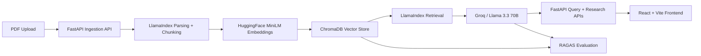

# DocMind AI

DocMind AI is a cost-conscious document intelligence system that turns raw PDFs into a grounded Q&A and research experience. It combines a FastAPI + LlamaIndex + ChromaDB retrieval pipeline, Groq-hosted Llama 3.3 70B for fast cited answers, a LangChain ReAct agent for document-first research with Tavily fallback, SSE token streaming for a live chat UX, and a Groq-backed RAGAS evaluation loop so the system can be measured as well as demoed.

## Architecture



## Tech Stack

| Layer | Choice | Why This Choice |
| --- | --- | --- |
| Backend API | FastAPI | Clean async Python APIs, fast iteration, great DX for AI backends |
| RAG orchestration | LlamaIndex | Strong document ingestion, retrieval abstractions, and good fit for PDF-heavy pipelines |
| Vector database | ChromaDB | Simple persistent local vector store, easy to run in Docker, good for portfolio demos |
| LLM | Groq + `llama-3.3-70b-versatile` | Open-weight model, very fast inference, generous free tier, strong interview signal |
| Embeddings | `sentence-transformers/all-MiniLM-L6-v2` | Free local embeddings, no API dependency, reproducible and cost-efficient |
| Agent layer | LangChain ReAct + Tavily | Model-agnostic tool orchestration with a familiar agent pattern and live web fallback |
| Streaming UX | FastAPI SSE + React ReadableStream | Simple token streaming over POST requests without websocket complexity |
| Evaluation | RAGAS + Groq judge + HF embeddings | Lets the system measure grounding and retrieval quality without paying for OpenAI |
| Deployment | Docker Compose | One-command local orchestration for API + ChromaDB |

## What It Does

- Uploads one or more PDFs and stores chunked embeddings in ChromaDB
- Answers document questions with citations and a confidence score
- Streams token-by-token answers to the frontend over SSE
- Runs a document-first research agent that falls back to Tavily when local confidence is low
- Evaluates RAG quality with faithfulness, answer relevancy, and context recall

## Quick Start

1. Copy the environment template:

```bash
cp backend/.env.example backend/.env
```

2. Fill in at least:

```bash
GROQ_API_KEY=...
TAVILY_API_KEY=...
```

3. Start the stack:

```bash
docker compose up --build
```

4. Open the API docs:

```bash
http://localhost:8000/docs
```

The Compose setup starts:

- `docmind-api` on `http://localhost:8000`
- `docmind-chroma` on `http://localhost:8001`

## Core Endpoints

```bash
POST   /upload
POST   /query
POST   /query/stream
GET    /documents
DELETE /documents/{filename}
POST   /research
GET    /eval/results
POST   /eval/run
GET    /health
```

## Example Flows

Upload PDFs:

```bash
curl -X POST http://localhost:8000/upload \
  -F "files=@/absolute/path/to/document.pdf"
```

Ask a grounded question:

```bash
curl -X POST http://localhost:8000/query \
  -H "Content-Type: application/json" \
  -d '{"question":"What is the termination policy?","top_k":5}'
```

Stream the answer:

```bash
curl -N -X POST http://localhost:8000/query/stream \
  -H "Content-Type: application/json" \
  -H "Accept: text/event-stream" \
  -d '{"question":"Summarize the termination clause.","top_k":5}'
```

Run a research pass:

```bash
curl -X POST http://localhost:8000/research \
  -H "Content-Type: application/json" \
  -d '{"question":"Compare the uploaded policy with current industry guidance."}'
```

Run evaluation in the background:

```bash
curl -X POST http://localhost:8000/eval/run
curl http://localhost:8000/eval/results
```

## Frontend Notes

The frontend layer currently lives as React + Vite component scaffolding in `frontend/src`, including:

- [frontend/src/hooks/useStreamQuery.ts](/Users/adarshvashistha/Desktop/DockMind/frontend/src/hooks/useStreamQuery.ts)
- [frontend/src/components/StreamChat.tsx](/Users/adarshvashistha/Desktop/DockMind/frontend/src/components/StreamChat.tsx)
- [frontend/src/components/EvalDashboard.tsx](/Users/adarshvashistha/Desktop/DockMind/frontend/src/components/EvalDashboard.tsx)

The streaming hook uses `fetch()` + `ReadableStream` instead of `EventSource` so the UI can send a JSON POST body and still render token-by-token output.

## RAGAS Scores

Sample portfolio-grade target scores:

| Metric | Sample Score | What It Means |
| --- | --- | --- |
| Faithfulness | `0.88` | Answers are usually grounded in retrieved evidence rather than hallucinated |
| Answer Relevancy | `0.84` | Answers generally address the user question directly |
| Context Recall | `0.79` | Retrieval is bringing back enough relevant evidence, but still has room to improve |

These are sample benchmark targets for README presentation until you run evaluation on your own reference PDF and replace them with real numbers from `eval_results.json`.

Simple explanations:

- `Faithfulness`: Did the model stay grounded in the retrieved context?
- `Answer Relevancy`: Did it answer the actual question rather than drifting?
- `Context Recall`: Did retrieval bring back enough of the right evidence?

Healthy production expectations:

- `Faithfulness`: `0.85+`
- `Answer Relevancy`: `0.80+`
- `Context Recall`: `0.75+`, with `0.85+` being excellent for a narrow document domain

## Key Engineering Decisions

### Why Groq over OpenAI for this project?

Groq gave this project a better tradeoff for a portfolio build: fast inference, open-weight model branding, and a generous free tier. For a demo-heavy app with streaming answers, Groq's speed makes the UX visibly stronger, and using Llama 3.3 70B signals familiarity with the open-source LLM ecosystem instead of only proprietary APIs.

### Why local HuggingFace embeddings?

Local embeddings remove recurring API cost, keep document ingestion private, and make the system reproducible for reviewers. `all-MiniLM-L6-v2` is not the biggest model, but it is fast, reliable, and more than strong enough for a pragmatic RAG portfolio project.

### Why RAG instead of fine-tuning?

The documents change more often than the model should. RAG keeps knowledge external, updatable, and attributable, which is exactly what document intelligence systems need. Fine-tuning would be slower to update, harder to cite, and worse for source-grounded answers.

### Why LangChain for the research agent?

LangChain made it easy to build a model-agnostic ReAct agent on top of Groq, with explicit document search and web search tools. That keeps the agent layer portable if the model provider changes later.

### Why evaluate with RAGAS?

A demo without evaluation is incomplete. RAGAS gives DocMind a way to measure hallucination risk, question-answer alignment, and retrieval quality, which turns the project from “I built an app” into “I built and validated an AI system.”

## Evaluation Script

The evaluator lives at [backend/evaluate_rag.py](/Users/adarshvashistha/Desktop/DockMind/backend/evaluate_rag.py) and uses:

- `LangchainLLMWrapper(ChatGroq(...))` for the judge LLM
- `LangchainEmbeddingsWrapper(HuggingFaceEmbeddings(...))` for embedding-aware metrics
- `faithfulness`, `answer_relevancy`, and `context_recall`

The sample 10-question test set lives at [backend/eval_testset.json](/Users/adarshvashistha/Desktop/DockMind/backend/eval_testset.json). Replace those reference answers with the truths from your own sample PDF before publishing scores.

## Streaming Design

`POST /query/stream` uses FastAPI `StreamingResponse` with SSE events:

- `data: {"type":"citations","data":[...]}`
- `data: {"type":"token","content":"..."}`
- `data: {"type":"done"}`

Groq is fast enough that token streaming can feel almost instant, so the frontend hook includes optional pacing to create a more natural typing rhythm. For demos, frontend pacing is usually better than server-side delay because it preserves backend responsiveness.

## Cost Profile

This project was designed to stay extremely cheap to build and demo.

| Service | Free / Low-Cost Behavior |
| --- | --- |
| Groq | Free-tier inference for development and demos, subject to current account limits |
| HuggingFace embeddings | Runs locally, no API bill |
| ChromaDB | Self-hosted in Docker |
| Tavily | Free research credits for small-scale agent demos |
| RAGAS | Open-source evaluation library |

The result is a practical AI systems project that can be demonstrated without ongoing API-heavy burn.

## Interview Angle

DocMind AI is strongest when presented as an AI systems project rather than just a chatbot. The signal is in the combination of retrieval, source-grounded generation, tool-using agents, streaming UX, evaluation, and cost-aware infrastructure choices.

Use [INTERVIEW_PREP.md](/Users/adarshvashistha/Desktop/DockMind/INTERVIEW_PREP.md) for portfolio storytelling, likely interview questions, and a demo script.
